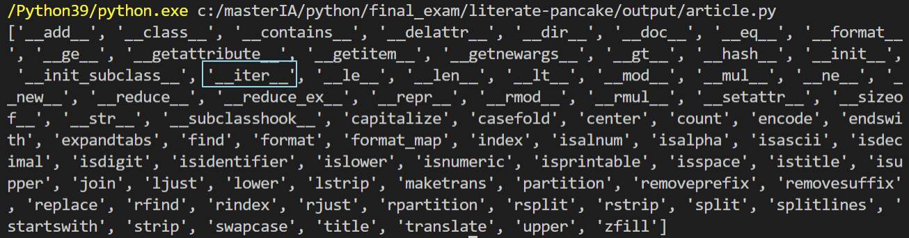

# <span style="color: #0AA1DD">Introduction</span> #

Dans la vie des êtres humains, les tâches répétitives sont exécutées quotidiennement. Dans l’informatique pour faciliter la vie, les applications développées dans ce sens implémentent beaucoup de tâches répétitives. Python qui est l’un des langages de programmation les plus populaires aujourd’hui implémente également ce principe de tâches réplétives appelé itération.
En programmation python ou tout autre langage de programmation boucler ou traverser une séquence est l’aspect le plus commun. Les boucles for et while dans Python peuvent traiter presque toutes les tâches répétitives à exécuter par les programmes. Itérer sur une séquence est tellement utilisé dans que python offre des capacités extras pour faciliter son utilisation et le rendre plus performant et efficient.\
certaines de ces capacités pour traiter les séquences sont les itérateurs et les générateurs. Cet article va disséquer les itérateurs et générateurs.\

# <span style="color: #0AA1DD">Itérable et Itérateurs en Python</span> #
\
\

Un itérateur est un objet qui contient un nombre comptable d’élément et il est utilisé pour itérer les objets comme les listes, les tuples, les strings, etc. les itérateurs sont implémentés comme classe et une variable locale pour itérer n’est pas requise. Ils utilisent la «lazy evaluation » où l’évaluation de l’expression sera maintenue et gardée en mémoire jusqu’à ce qu’il soit rappelé spécifiquement pour éviter l’évaluation répétitive.
Pour être considéré comme itérable, l’objet doit implémenter les méthodes \__iter__() et \__next__().
\
### <span style="color: #2155CD">\__iter()__</span> ### 
\
\
Supposons que nous avons :

Code :
```python

Numbers = [1, 2, 3, 4, 5, 6, 7]

print(dir(Numbers))
```
Résultat :
```output
['__class__', '__delattr__', '__dir__', '__doc__', '__eq__', '__format__', '__ge__', '__getattribute__', '__gt__', '__hash__', '__init__', '__init_subclass__', '__iter__', '__le__', '__length_hint__', '__lt__', '__ne__', '__new__', '__next__', '__reduce__', '__reduce_ex__', '__repr__', '__setattr__', '__setstate__', '__sizeof__', '__str__', '__subclasshook__']
```
On constate dans le résultat du code que la méthode \__iter__() est présente.



Pour qu'une boucle fonctionne, elle appelle la méthode \__iter__(), qui retourne un itérateur. La boucle utilise l'itérateur pour parcourir les éléments.

Syntaxe :
```output
iter( object , sentinel )
```
La méthode iter() prend deux paramètres :
- <span style="color:#06283D">Object</span> : un objet dont l’itérateur doit être créé par exemple les listes, tuples, sets, etc.
- <span style="color:#06283D">Sentinel</span> : une valeur spéciale qui représente la fin de la séquence. Ce paramètre est optionnel.

### <span style="color: #2155CD">\__next()__</span> ### 
\
\

Un itérateur est un objet avec un état. C’est-à-dire qu’il se souvient de son état pendant l’itération. L’itérateur sait également comment récupérer l’élément suivant. Ils utilisent la méthode \__next__() pour récupérer l’élément suivant.  Cette méthode est obligatoire pour tout itérateur. La méthode garde une valeur à la foi.

Syntaxe :
```output
next( iterator , default )
```
La méthode next() accepte deux paramètres :
- <span style="color:#06283D">Iterator</span> : la méthode next() retourne la valeur suivante de l’itérateur.
- <span style="color:#06283D">Default</span> : cette valeur est retournée si l’itérateur n’a plus de valeur à retourner. Ce paramètre est optionnel.

Nous allons faire un exemple avec une liste de différents types pour mieux comprendre :

```python
list = [ 77 , 1, 'DIT', 'Dakar', 'is fun' ] 
```
\
Nous allons parcourir cette liste avec le protocole d'itérateur qui comprend les deux méthodes iter() et next().

Code :
```python
#get an iterator using iter()
list_iter = iter(list)

#print the iterator
print(list_iter)

#next for fetching the first element which is 77
print(next(list_iter))

#fetching the remaining elements
print(next(list_iter))
print(next(list_iter))
print(next(list_iter))
print(next(list_iter))
```
Résultat :
```output 
<list_iterator object at 0x0000011229AD3F70>
77
1
DIT
Dakar
is fun

[Done] exited with code=0 in 0.078 seconds
```

Comme vous pouvez le constater quand on imprime le résultat de l’itérateur list_iter, il affiche le type et l’adresse mémoire. Ensuite il affiche les éléments un à un. Qu’est-ce qui va se passer si on essaie d’afficher le prochain élément alors que la liste est déjà parcourue.

Code :
```python
#trying to fetch next element after the last value is returned
print(next(list_iter))
```

Résultat :
```output
Traceback (most recent call last):
  File "tempCodeRunnerFile.py", line 20, in <module>
    print(next(list_iter))
StopIteration

[Done] exited with code=1 in 0.082 seconds
```

### <span style="color: #2155CD">Stopiteration</span> ###
\
\
Quand on essaie d’afficher la valeur suivante alors que l’itérateur n’en a plus on a une exception de type Stopiteration qui veut dire que la séquence a épuisé ses éléments.
Il est important de souligner ici que les boucles for pour itérer, l'exception Stopiteration est gérée en interne et utiliser pour terminer la boucle sans erreur. Si nous utilisons un itérateur, nous devons gérer nous-mêmes le cas des exceptions Stopiteration.

Exemple d'itérateur :

Code :
```python
class MyOddNumber:
    def __iter__(self):
        self.a = 1
        return self
    
    def __next__(self):
        if self.a <= 7 :
            x = self.a
            self.a += 1
            return x
        # else:
        #     raise StopIteration
        
myclass = MyOddNumber()
myiter = iter(myclass)

for x in myiter:
    print(x)
```

Résultat :
```output
[Running] python -u "article2.py"
1
2
3
4
5
6
7
None
None
None
None
```
Ce code continue l'exécution indéfiniment après la dernière valeur retournée jusqu'à ce qu'on l'arrête.\
\
Nous allons maintenant ajouter la condition d'arrêt de l'exécution dès que la dernière valeur est retournée.\
\
Code :

```python
class MyOddNumber:
    def __iter__(self):
        self.a = 1
        return self
    
    def __next__(self):
        if self.a <= 7 :
            x = self.a
            self.a += 1
            return x
        #Condition d'arrêt
        else:
            raise StopIteration
        
myclass = MyOddNumber()
myiter = iter(myclass)

for x in myiter:
    print(x)
```

Résultat :
```output
[Running] python -u "article2.py"
1
2
3
4
5
6
7

[Done] exited with code=0 in 0.081 seconds
```

Nous constatons maintenant que l'itération se passe correctement et s'arrête dès que la dernière valeur est retournée.\

# <span style="color: #0AA1DD">Générateurs</span> #
\
\
Utiliser des itérateurs dans python peut s'avérer fastidieux et demande beaucoup d'effort de la part du développeur. Il faut créer une classe contenant les méthodes \__iter__() et \__next__(), garder l'état de l'itérable et faire un Stopiteration pour terminer l'itérateur quand il n'y a plus de valeur à retourner. Dans ces cas les générateurs peuvent venir à la rescousse.\

Un générateur dans Python permet de créer une fonction itérateur. Un générateur est une fonction qui retourne un objet générateur qui génère une succession de valeur au lieu de retourner une seule valeur. Il ne stocke aucune valeur, ce qui le rend très performant dans l'utilisation de la mémoire. Par exemple on peur faire une boucle sur un groupe de nombre sans en stocké un seul en mémoire.\
Le mot clé yield remplace return dans la fonction générateur. La différence est que return termine l'exécution d'une fonction normale alors que yield pause la fonction tout en gardant son état et continue l'exécution au prochain appelle de la fonction générateur.\

Pour illustrer ce concept, nous allons créer une fonction qui va calculer 3 à la puissance du paramètre donné.\


Code :
```python
# Program to print the Power of two up to the given number
def Power3Gen( max=0 ):
   n = 1
   while n < max:
       yield 3 ** n
       n += 1

a = Power3Gen(6)

# Printing the values stored in a
for i in a:
   print(i)
```

Résultat :
```output
[Running] python -u "article3.py"
3
9
27
81
243

[Done] exited with code=0 in 0.072 seconds
```

Comme le générateur gère les informations de manière automatique, l'implémentation est plus courte, compacte et efficiente.\

Avec les fonctions générateurs, il est possible d'itérer les valeurs avec une boucle ou avec l'une des méthodes next() ou list(). Nous allons créer une fonction génératrice qui va afficher uniquement les valeurs impaires à partir d'une liste de nombre.\

### <span style="color: #2155CD">Méthode 1 : la boucle</span> ###
\
\
Code :
```python
def filter_odd(numbers):
   for number in range(numbers):
       if(number%2!=0):
           yield number


odd_numbers = filter_odd(20)
for num in odd_numbers:
   print(num)
```

Résultat :
```output
[Running] python -u "article3.py"
1
3
5
7
9
11
13
15
17
19

[Done] exited with code=0 in 0.093 seconds
```
\
### <span style="color: #2155CD">Méthode 2 : la méthode list()</span> ###
\
\
Code :
```python
def filter_odd(numbers):
   for number in range(numbers):
       if(number%2!=0):
           yield number


odd_numbers = filter_odd(20)
print(list(odd_numbers))
```

Résultat :
```output
[Running] python -u "article3.py"
[1, 3, 5, 7, 9, 11, 13, 15, 17, 19]

[Done] exited with code=0 in 0.069 seconds
```

Le résultat est affiché comme une liste.
\
### <span style="color: #2155CD">Méthode 3 : la méthode next()</span> ###
\
\
Code :
```python
def filter_odd(numbers):
   for number in range(numbers):
       if(number%2!=0):
           yield number


odd_numbers = filter_odd(20)
print(next(odd_numbers))
print(next(odd_numbers))
print(next(odd_numbers))
print(next(odd_numbers))
print(next(odd_numbers))
print(next(odd_numbers))
```

Résultat :
```output
[Running] python -u "article3.py"
1
3
5
7
9
11

[Done] exited with code=0 in 0.08 seconds
```

Il est important de noter s'il ne reste aucune valeur à retournée et qu'on invoque la méthode next() elle va retourné une erreur Stopiteration.\
\
## <span style="color: #73A9AD">performance des générateurs</span> ##
\
\
On va faire une comparaison de performance entre une fonction normale et une fonction génératrice.\

Dans cette illustration, il ya une liste de 10 nombres et 2 fonctions :

- une fonction data_list() qui sélectionne aléatoirement un nombre n fois dans une liste.
- une fonction génératrice data_generator() qui sélectionne également un nombre n fois dans une liste.

le code ci-dessous compare le temps d'exécution entre ces deux fonctions qui génère un million de nombres sélectionnés aléatoirement :

Code :

```python
import random
import timeit
from math import floor

numbers = [1, 2, 3, 4, 5, 6, 7, 8, 9, 10]

def data_list(n):
    result = []
    for i in range(n):
        result.append(random.choice(numbers))
    return result

def data_generator(n):
    for i in range(n):
        yield random.choice(numbers)

t_list_start = timeit.default_timer()
rand_list = data_list(1_000_000)
t_list_end = timeit.default_timer()

t_gen_start = timeit.default_timer()
rand_gen = data_generator(1_000_000)
t_gen_end = timeit.default_timer()

t_gen = t_gen_end - t_gen_start
t_list = t_list_end - t_list_start

print(f"List creation took {t_list} Seconds")
print(f"Generator creation took {t_gen} Seconds")

print(f"The generator is {floor(t_list / t_gen)} times faster")
```

Résultat :
```output
[Running] python -u "article3.py"
List creation took 0.4281648 Seconds
Generator creation took 2.2000000000077513e-06 Seconds
The generator is 194620 times faster

[Done] exited with code=0 in 0.515 seconds
```

Nous pouvons constater que la fonction génératrice est beaucoup plus rapide que la fonction normale. C'est dù au fait que la fonction data_list() stocke les tous les numéros en mémoire alors que le générateur ne stocke rien d'où sa rapidité.\
\
## <span style="color: #73A9AD">Générateur vs fonction normale</span> ##
\
\
Quand on appelle une fonction normale, l'exécution s'arrête dès que la commande return est atteinte. Donc quand on appelle une fonction normale il n'est pas possible d'interrompre son exécution. Dans le cas de fonction génératrice dès que la commande return est atteinte, l'exécution est pausé et la valeur est retournée. Quand l'objet appelant le générateur fait une itération sur la valeur, la prochaine fois que la commande yield est exécutée et le cycle continu.\

## <span style="color: #73A9AD">**Tableau comparatif**</span> ##
\
\
|                                                                                                                                       **Générateur**                                                                                                                                      	|                                                                  **Fonction normale**                                                                 	|
|:-----------------------------------------------------------------------------------------------------------------------------------------------------------------------------------------------------------------------------------------------------------------------------------------:	|:-----------------------------------------------------------------------------------------------------------------------------------------------------:	|
| Lorsque la fonction génératrice est appelée, elle regroupe toutes les valeurs de retour de yield dans un objet générateur et les renvoie. De plus, l'exécution du code ne démarre que lorsque l'objet est parcouru.                                                                        	| Il ne renvoie qu'une seule valeur lorsqu'il est appelé et l'exécution du code s'arrête dès qu'il atteint l'instruction de retour.                     	|
| Lorsque la fonction génératrice est appelée, le premier yield est exécuté et la fonction s'arrête. Il renvoie ensuite l'objet générateur où la valeur est stockée. Lorsque l'appelant a accédé ou itéré sur cette valeur, l'instruction yield suivante est exécutée et le cycle se répète. 	| Lorsqu'une fonction normale est appelée, l'exécution commence et se termine dès qu'il atteint une instruction de retour. Il renvoie ensuite la valeur. 	|
| Vous pouvez utiliser plusieurs instructions yield dans une fonction de générateur.                                                                                                                                                                                                        	| Une seule instruction return dans une fonction normale peut être utilisée.                                                                            	|
| Il n'y a pas d'allocation de mémoire lorsqu'on utilise le mot-clé yield.                                                                                                                                                                                                              	| Pour toutes les valeurs renvoyées, de la mémoire est allouée.                                                                                         	|
| Extrêmement économe en mémoire, en particulier pour les grands ensembles de données.                                                                                                                                                                                                      	| Ne dois être utilisé qu'avec de petits ensembles de données.                                                                                          	|
# <span style="color: #0AA1DD">Itérateur vs Générateur</span> #
\
\
Nous allons dresser un tableau comparatif entre les itérateurs et les générateurs :\

## <span style="color: #73A9AD">**Tableau comparatif **</span> ##

| **Itérateur**                                                                                                    	| **Générateur**                                                                                                                                     	|
|----------------------------------------------------------------------------------------------------------------	|-------------------------------------------------------------------------------------------------------------------------------------------------	|
| Les itérateurs sont des objets qui utilisent la méthode next() pour obtenir la valeur suivante de la séquence. 	| Un générateur est une fonction qui produit ou renvoie une séquence de valeurs à l'aide d'une instruction yield.                                 	|
| Les classes sont utilisées pour implémenter les itérateurs.                                                    	| Les fonctions ou les compréhensions sont utilisées pour implémenter le générateur.                                                              	|
| Chaque itérateur n'est pas forcément un générateur.                                                            	| Chaque générateur est forcément un itérateur.                                                                                                   	|
| Implémentation complexe des protocoles itérateurs, c'est-à-dire l'utilisation de iter() et next().             	| Les générateurs en Python sont plus simples à coder et les codes sont plus compacts que l'itérateur personnalisé utilisant l'instruction yield. 	|
| Les itérateurs en python sont moins efficaces en mémoire.                                                      	| Les générateurs en Python sont plus efficaces dans l'utilisation de la mémoire.                                                                  	|
| Aucune variable locale n'est utilisée dans les itérateurs.                                                     	| Toutes les variables locales sont stockées avant l'instruction yield.                                                                           	|
| -                                                                                                              	| Un générateur peut avoir n'importe quel nombre d'instructions "yield".                                                                          	|
\
# <span style="color: #0AA1DD">Conclusion</span> #
\
\
A la suite de l'exposé, nous constatons que les générateurs sont des outils puissants qui peuvent nous permettre de booster la performance de nos fonctions. Dans le domaine du Data Science où le volume de données à traiter peut jouer sur la performance du système, ces principes nous permettent de mieux gérer ces données.\