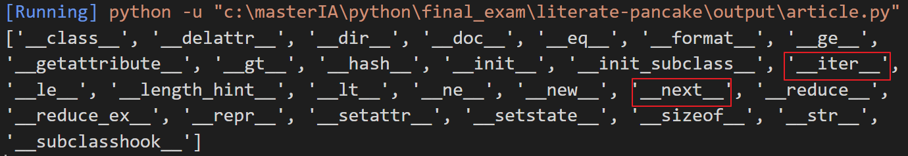

# Introduction

Dans la vie des être humain les tâches répétitives sont exécutés quotidiennement. Dans l’informatique pour faciliter la vie, les applications développées dans ce sens implémentes beaucoup de tâches répétitives. Python qui est l’un des langages de programmation les plus populaire aujourd’hui implémente également ce principe de tâches réplétives appelé itération.\
En programmation python ou tout autres langages de programmation boucler ou traverser une séquence est l’aspect le plus commun. Les boucle for et while dans python peuvent traiter presque toutes les tâches répétitives exécuter par les programmes. Itérer sur une séquence est tellement utilisé dans que python offre des capacités extras pour faciliter son utilisation et le rendre plus performant et efficient.\
Certains de ces capacités pour traiter les séquences sont les itérateurs et les générateurs. Cet article va disséquer les itérateurs et générateurs.

# Itérable et Itérateurs en Python

Un itérateur est un objet qui contient un nombre comptable d’élément et il est utilisé pour itérer les objets comme les listes, les tuples, les strings, etc. les itérateurs sont implémentés comme classe et une variable locale pour itérer n’est pas requise. Ils utilisent la «lazy evaluation » où l’évaluation de l’expression sera maintenue et gardée en mémoire jusqu’à ce qu’il soit rappelé spécifiquement pour éviter l’évaluation répétitive.\
Pour être considéré comme itérable, l’objet doit implémenter les méthodes _ _iter_ _() et _ _next_ _().\
\
Supposons que nous avons :


```python

Numbers = [1, 2, 3, 4, 5, 6, 7]

print(dir(Numbers))
```
Résultat :
```output
['__class__', '__delattr__', '__dir__', '__doc__', '__eq__', '__format__', '__ge__', '__getattribute__', '__gt__', '__hash__', '__init__', '__init_subclass__', '__iter__', '__le__', '__length_hint__', '__lt__', '__ne__', '__new__', '__next__', '__reduce__', '__reduce_ex__', '__repr__', '__setattr__', '__setstate__', '__sizeof__', '__str__', '__subclasshook__']
```
On constate dans le resultat du code que la methode _ _iter_ _() est présent 



Pour qu'une boucle fonctionne, elle appelle la méthode _ _iter_ _(), qui retourne un itérateur. La boucle utilise l'itérateur pour parcourir les éléments.
Un itérateur est un objet avec un état. C’est-à-dire qu’il se souvient de son état pendant l’itération. L’itérateur sait également comment récupérer l’élément suivant. Ils utilisent la méthode _ _next_ _() pour récupérer l’élément suivant.  Cette méthode est obligatoire pour tout itérateur.
